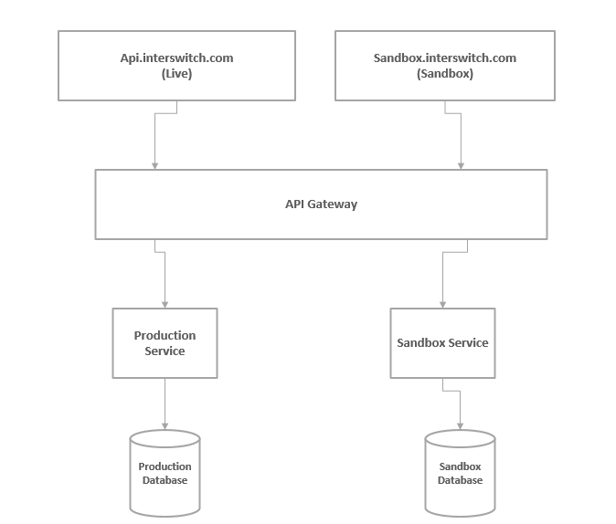
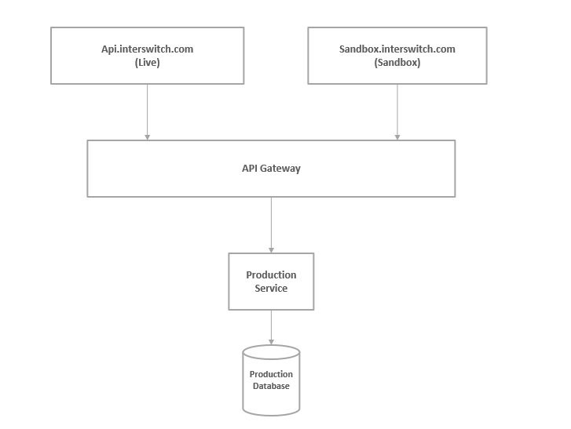

# 2. Sandbox

Date: 2019-04-29

## Status

Accepted

## Context
There is need to implement a sandbox environment that replicates the minimal functionality required to accurately test APIs during development and integration.
Presently, the sandbox environment is isolated from the production environment and database. This can negatively affect Developer Experience because sandbox or
UAT downstream services have significantly more downtime than their corresponding production services.
It is therefore necessary to implement a solution that maximizes uptime of both sandbox and production environments.
The current implementation for live and sandbox environments is represented below:

## Decision
- Both live and sandbox environments of a service should be routed to the same downstream production service.

- Test and live credentials should be separated on passport service by adding an extra claim with key "environment" and a value of either "TEST" or "LIVE".
This extra environment claim will be encoded into the JSON Web Token that is sent to the downstream services.
However, JWTs without this additional claim will be considered "LIVE" for backward compatibility.

- All production services should implement test logic using predetermined test cases and scenarios and their corresponding test responses. Subsequently, test or live algorithms
should be run by the production service only after verifying credential  type(test or live) from decoded JSON web token.

- API Gateway should be able to determine credential type (test or live) from the decoded JSON Web Token and dynamically forward or reject requests to downstream production services based on whether the request source matches credential type. This means,
requests made from a sandbox environment must use test credentials and requests made from live environment must use live credentials, this will ensure there are no
mistakes or unnecessary calls to the downstream production service. The new implementation can be represented as shown below:

## Consequences
We are eliminating the need for a dedicated sandbox service by routing both sandbox and production URLs to the same downstream production service.
We are also ensuring maximum uptime for the sandbox environment and handling scenarios where data needs to sync between sandbox and live databases.
However, by sharing resources between live and sandbox environment, every production service needs to be aware of the potential performance impact.
Production services should be monitored to prevent this and to ensure the production environment remains
 stable during testing. The possibility of the database getting filled with junk test data and scenarios of test data running live algorithms and vice versa should be rigorously tested for and eliminated.

